<div align="center">

# Blender Low Poly Modelling Skill

**Tell Claude Code what you want — get a finished, game-ready low-poly asset out of Blender: `.blend` + `.fbx` + textures + renders.**

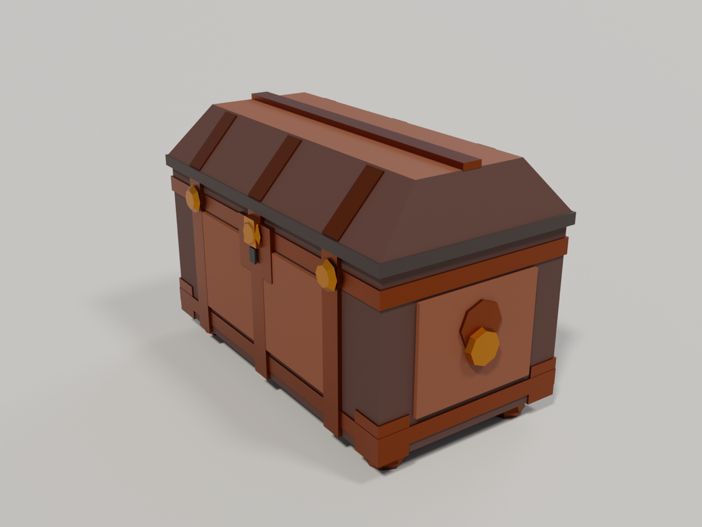

*"Low-poly Roman loot chest, 1.2 m, ≤ 2 500 tris, wood + bronze, collider, Unity/URP" → 868 triangles, Cycles render, one run.*

</div>

---

## Download & install (2 minutes)

**1. Get the skill**

```bash
git clone https://github.com/ozanzeng/blender-LPM-skill.git
```
or press **Code → Download ZIP** on this page and unzip it.

**2. Put it into your project**

```bash
# the folder that matters is skills/blender-lpm-skill
cp -r blender-LPM-skill/skills/blender-lpm-skill  <your-project>/.claude/skills/
```
Windows (PowerShell):
```powershell
Copy-Item -Recurse blender-LPM-skill\skills\blender-lpm-skill  <your-project>\.claude\skills\
```

**3. Requirements**

| | |
| --- | --- |
| Blender | 4.2 or newer (tested on **5.2 LTS**, Windows 11 / RTX 3070 Ti). Default install path is found automatically; otherwise set `BLENDER_EXE`. |
| Python | 3.9+ on the host (for the helper scripts) |
| Agent | Claude Code (or any agent that reads `SKILL.md`: Codex, Cursor) |
| Optional | Blender MCP (official Blender Lab server or ahujasid/blender-mcp) for live sessions — not required, everything runs headless |

**4. Use it** — open Claude Code in your project and write a brief in plain language. Example:

> Low-poly Roman gladius, 0.65 m, 1 200 triangles, palette material, FBX for Unity. Render 5 views and check the gates.

The skill builds the model from primitives with a recipe script, renders it, checks it, and exports it. Files land in `_work/<asset>/`.

---

## The prompts we ran (verbatim)

| # | Prompt (as given, Turkish) | Meaning | Result |
| --- | --- | --- | --- |
| 1 | *"tamam güzel sandığı boya ve render al bakalım nasıl görünüyor"* (after *"bana low poly sandık çiz"*) | "Draw me a low-poly chest" → "nice, now paint it and render it, let's see" | `SM_Chest` — 576 tris / budget 800, barrel lid with alternating planks, iron straps + rivets, lock, brackets, handles; Cycles render below |
| 2 | *"low-poly bir Roma ganimet sandığı oluştur. Mobil Unity/URP hedefli olsun; kapalı halde 1.2 m genişlik, en fazla 2.500 üçgen, ahşap gövde ve bronz şeritler, ayrı basit çarpışma gövdesi, uygulanmış transformlar, UV'ler ve materyaller içersin. Düzenlenebilir .blend ile .fbx teslim et; ayrıca turntable/inceleme renderı üret."* | "Create a low-poly Roman loot chest for mobile Unity/URP: closed, 1.2 m wide, max 2 500 tris, wood body + bronze straps, separate simple collision body, applied transforms, UVs and materials. Deliver editable .blend + .fbx and a turntable/inspection render." | `SM_RomanChest` — 868 tris + 12-tri `_COL` collider, 1.20 × 0.69 × 0.80 m, gates PASS, `.blend` + `.fbx` + palette textures, 48-frame turntable MP4, Cycles renders, one-file asset card |
| 3 | *"benim için blenderda skill kullanarak low poly villa bir ev tasarla"* | "Design a low-poly villa house for me in Blender using the skill" | `SM_RomanVilla` — 1 580 tris / budget 3 000, 23 × 17 × 8 m: hipped terracotta roofs, 4-column portico, arched door, tower, wing, shuttered windows, plinth with steps and gate piers, two cypresses; collider, turntable, Cycles renders, asset card |

<table>
<tr>
<td align="center">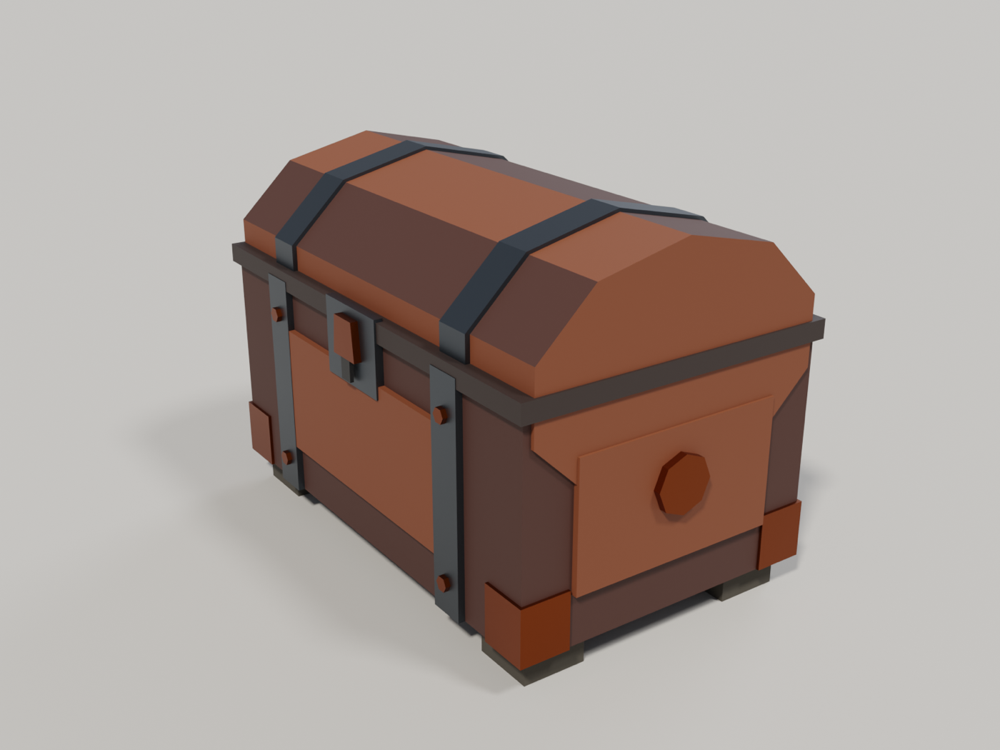<br><sub>Prompt 1 — <code>SM_Chest</code>, Cycles</sub></td>
<td align="center">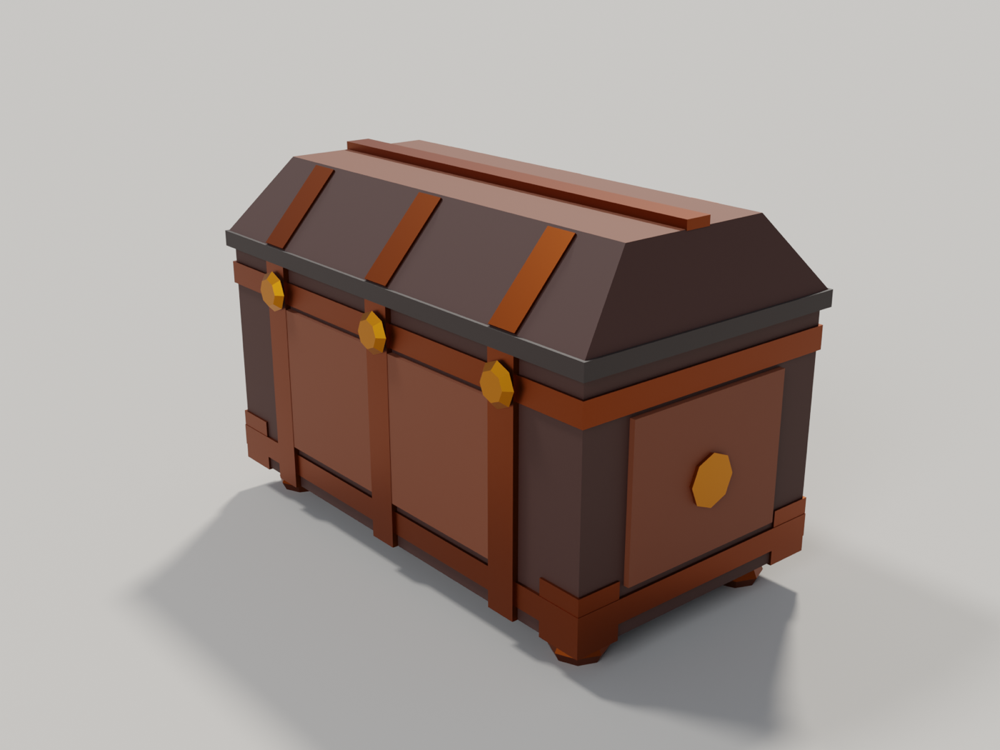<br><sub>Prompt 2 — <code>SM_RomanChest</code>, Cycles, back three-quarter</sub></td>
</tr>
<tr>
<td align="center">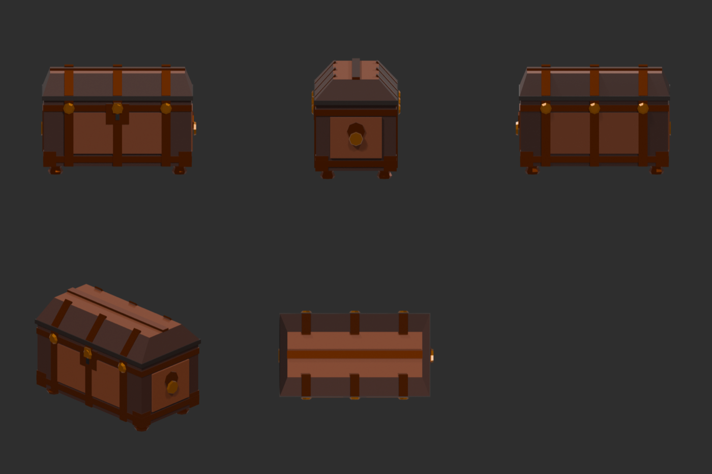<br><sub>Prompt 2 — automatic 5-view inspection sheet</sub></td>
<td align="center">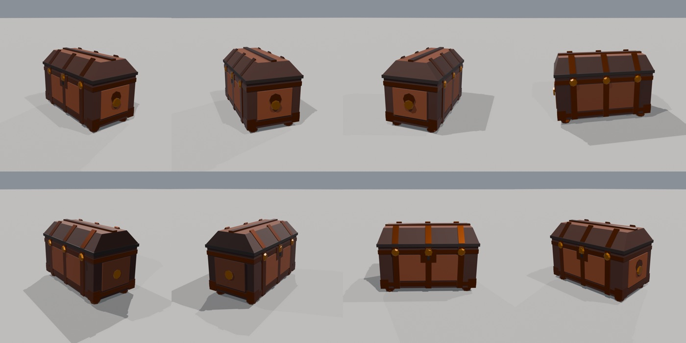<br><sub>Prompt 2 — 8 frames of the 48-frame turntable</sub></td>
</tr>
<tr>
<td align="center">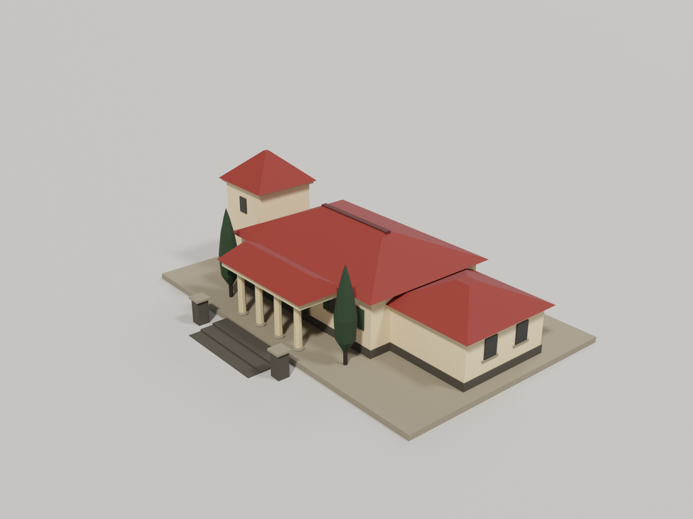<br><sub>Prompt 3 — <code>SM_RomanVilla</code>, Cycles</sub></td>
<td align="center">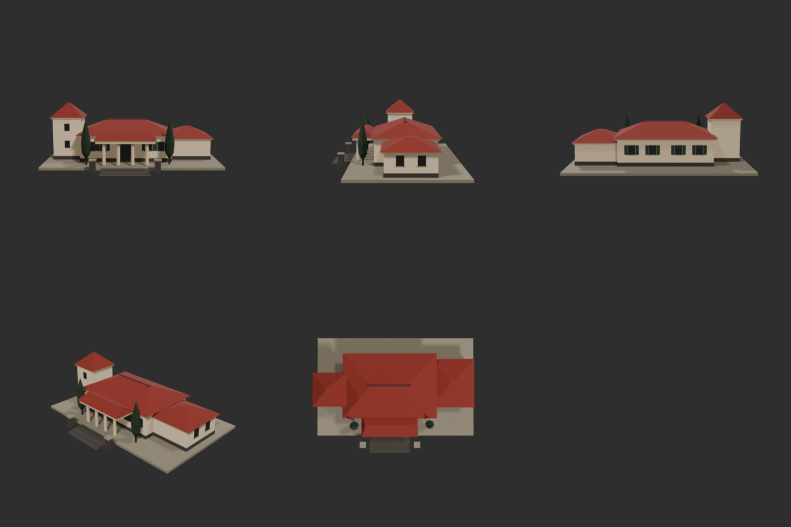<br><sub>Prompt 3 — 5-view inspection sheet</sub></td>
</tr>
</table>

All three were produced end-to-end by the skill's loop: **brief → part list → recipe script → build → render → look → fix → gates → export → asset card**. Prompt 2 needed two iterations (the collision box leaked into the first render; lid straps poked above the ridge); prompt 3 needed two (plinth too small, garden wall inside the tower) — every fix went back into the skill or the recipe.

---

## What you get per asset

```
_work/<asset>/
  <Name>.blend                editable scene (asset + <Name>_COL collider in its own collection)
  <Name>.fbx                  Unity axes (-Z forward, Y up), 1 unit = 1 m, transforms applied
  tex/<Name>_BaseColor.png    palette (sRGB)
  tex/<Name>_MaskMap.png      R metallic · G occlusion · A smoothness (Unity URP/HDRP mask layout)
  views/sheet.png             front / side / back / three-quarter / top
  beauty_*.png                presentation renders (EEVEE or Cycles)
  turntable/*.mp4 + sheet     360° turntable
  inspect.json, gates.md      measurements + PASS/FAIL gate report
  <Name>_card.html / .md      prompt + recipe + metrics + renders in one shareable file
```

---

## More examples (all in `examples/`, all built by the same toolkit)

<table>
<tr>
<td align="center">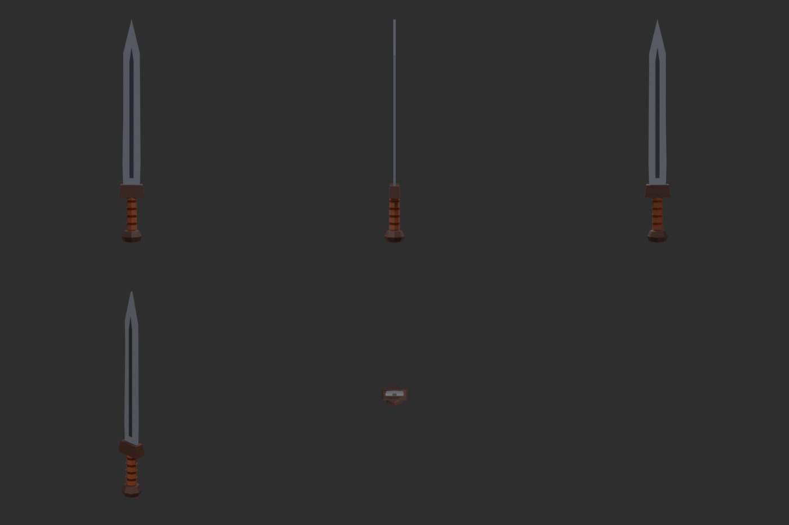<br><sub>Gladius — 268 tris</sub></td>
<td align="center">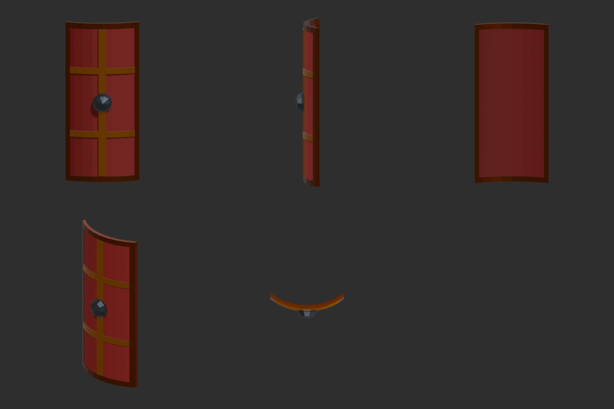<br><sub>Scutum — 436 tris, bent body</sub></td>
<td align="center">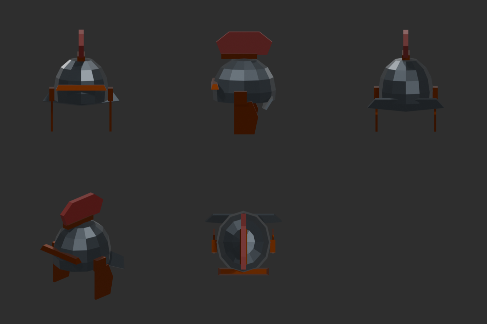<br><sub>Galea helmet — 234 tris</sub></td>
<td align="center">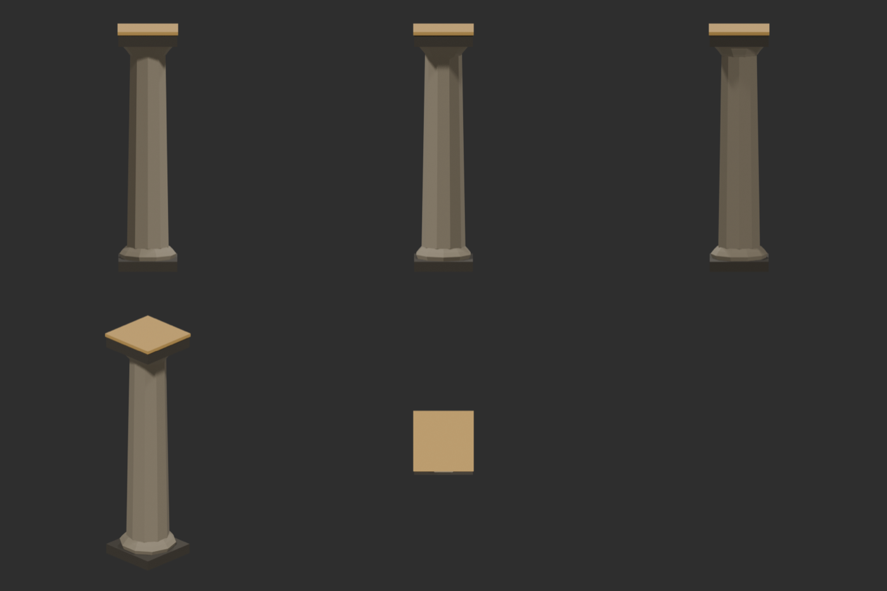<br><sub>Arena column — 224 tris</sub></td>
</tr>
</table>

## Figures from a 4-view sheet (Route C)

For figures that must match a reference (a lion, an eagle, a skull), primitives and silhouette hulls are not enough.
`multiview_to_mesh.py` sends a front/back/left/right sheet to Hunyuan3D v3 (via fal.ai), `gen_to_lowpoly.py` orients,
scales and decimates the result keeping UVs, and `gltf_pbr_to_unity.py` packs the PBR set for Unity URP. The Roman
lion altar came back with a real faceted lion at orthographic IoU 0.92 / 0.95 / 0.96 against the sheet.

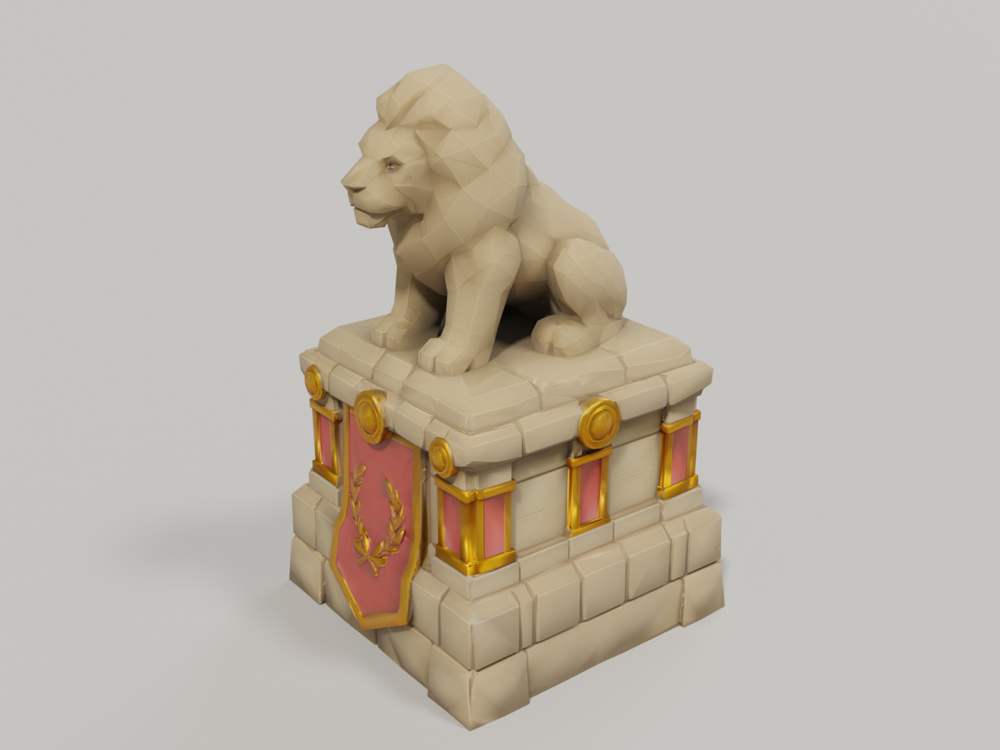

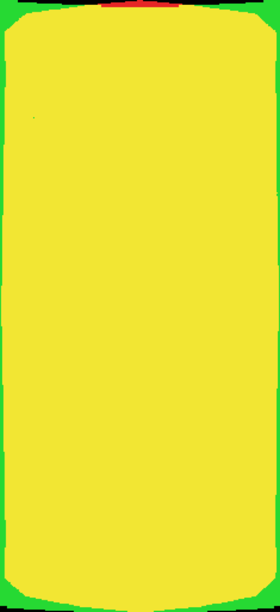

**Reference matching:** `compare_silhouette.py` overlays a render on your concept art (red = reference only, green = model only, yellow = match) and reports IoU, aspect and centroid errors. The scutum went from IoU 0.78 / 23 % aspect error to **IoU 0.95 / 0.9 %** by changing two numbers in its recipe.

<br clear="all">

---

## How it works

1. **Brief → budget.** One line: asset, real size in metres, triangle budget, palette, engine.
2. **Part list.** 4–12 primitive parts, each with a palette colour.
3. **Recipe.** A ~30-line Python script using `lpm.py` — `box`, `grid_box`, `prism`, `lathe`, `sweep`, `plate`, then `bend` / `taper` / `mirror_x` / `paint`; `finish()` joins, welds, grounds, writes palette UVs, assigns one material, checks the budget; `collision_box()` adds a collider; `export_unity()` writes the files.
4. **Look.** `render_views.py` renders five views; the agent reads the sheet and fixes the recipe (three iterations is normal).
5. **Gates.** `inspect_scene.py` + `gate_report.py`: budget, transforms, ground, UVs, empty slots, degenerate faces, loose vertices.
6. **Deliver.** `beauty_render.py`, `turntable.py`, `asset_card.py`.

Everything runs **headless** (`scripts/bl.py` starts Blender with factory settings) so results are reproducible; with Blender MCP the same recipes run in the open scene.

```python
import os, sys; sys.path.insert(0, ".claude/skills/blender-lpm-skill/scripts"); import lpm
lpm.reset()
P = lpm.Palette(lpm.PALETTE_ROMAN)
head = lpm.sweep("head", [(-0.09, 0), (0.09, 0), (0.12, 0.14), (0, 0.19), (-0.12, 0.14)], depth=0.02, at=(0, 0, 1.15), color=P["iron"])
haft = lpm.prism("haft", 8, 0.018, 1.15, at=(0, 0, 0), color=P["wood"], radius_top=0.016)
axe  = lpm.finish("SM_Axe", [head, haft], P, budget=900)
lpm.export_unity(axe, "_work/axe/SM_Axe", extra=[lpm.collision_box(axe)])
```

---

## Folder map

```
skills/blender-lpm-skill/
  SKILL.md                 what the agent reads: procedure, style rules, toolkit summary
  references/              budgets & facet counts, palette design, recipe rules, Unity export contract, QA checklist
  scripts/
    lpm.py                 the toolkit
    bl.py                  run Blender headless
    render_views.py        5-view sheet          beauty_render.py   presentation render
    turntable.py           360° MP4 + sheet      inspect_scene.py   measurements
    gate_report.py         PASS/FAIL gates       compare_silhouette.py  reference overlay
    asset_card.py          one-file delivery card
  examples/                gladius, scutum, galea_helmet, arena_column, chest, roman_chest, roman_villa
docs/images/               renders used in this README
```

## Low-poly rules baked in

Flat shading only · silhouette before surface · one palette material, no bakes, no normal maps · real metres, base on z = 0 · symmetry by mirror · no coplanar faces between parts (they render black) · every triangle earns its place.

## License

MIT © 2026 Ozan Zengin — original work, no third-party skill content.
Companion collection (routing hub, retopology, UV/PBR, rigging, reference matching): [blender-modelling-skills](https://github.com/ozanzeng/blender-modelling-skills).
